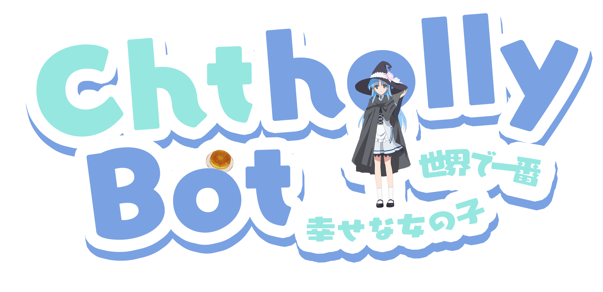

  

  <h1 id="Chatholly"><a href="https://github.com/FrostN0v0/Chtholly" target="_blank">Chatholly UwU</a></h1>
  
✨ Chatholly Bot Logo ✨

> [!Important]
> In no circumstances do I allow the use of a logo I created for AI learning.

## 🧰 使用工具

- Adobe Photoshop 2024 (Chinese ver.)
- Font: FOT - ユールカ (FOT - Eureka)

# 🎀 𝓒𝓱𝓽𝓱𝓸𝓵𝓵𝔂

>_我曾经发誓要永远和他在一起，能够如此发誓，让我无比幸福。_  
>_——我曾经发誓要永远和她在一起，能够如此发誓，让我心获安详。_  
>_我曾经认为自己喜欢这个人。_  
>_我曾经觉得自己非常珍视她。_  
>_能有如此感受，让我无比幸福_  
>_——能有如此感受，让我无比喜悦。_  
>_他曾经对我说，我一定会让你幸福。_  
>_——我曾经对她说，我一定会让你幸福。_  
>_能够听到他那样说，让我无比幸福。_  
>_——能够对她那么说，让我心获满足。_  
>_那个人，分了这么多的幸福给我。_  
>_——我从她那，得到了这么多的东西，可是我却……_  
>_所以，我敢肯定，现在的我，不管别人怎么说，都一定是世界上最幸福的女孩。_